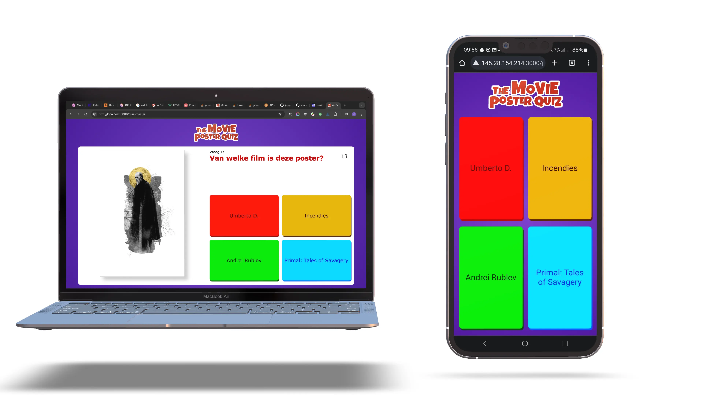
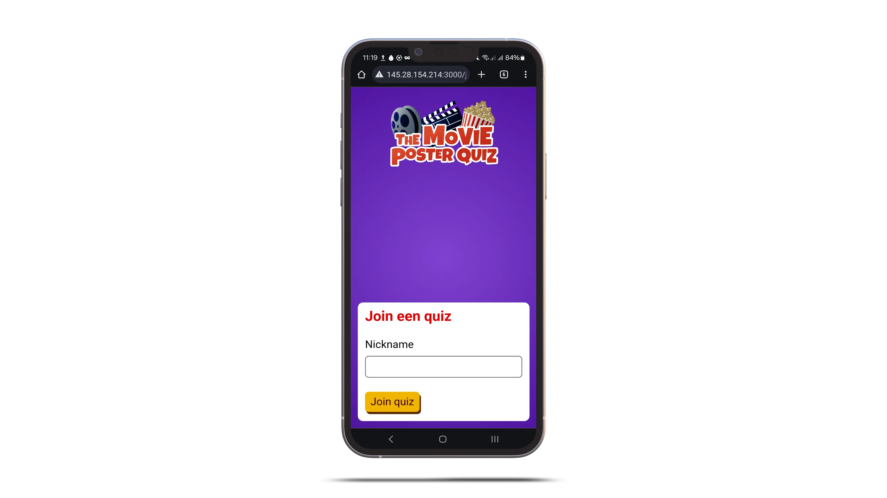
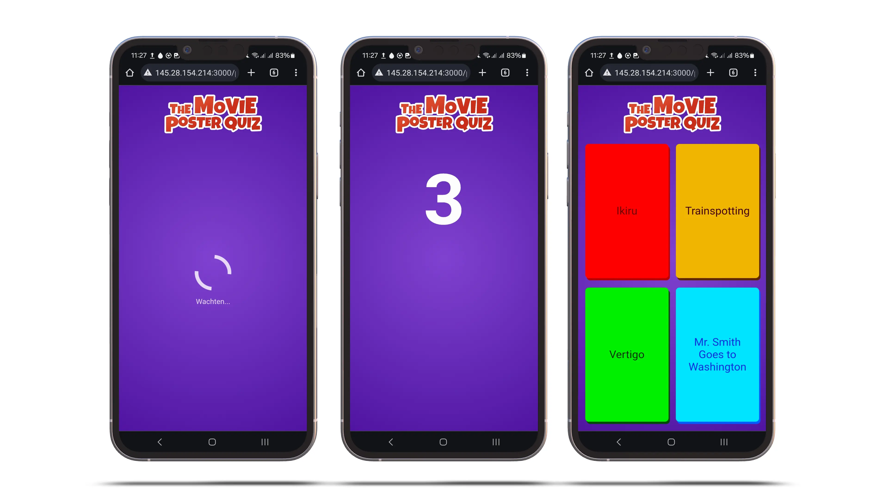
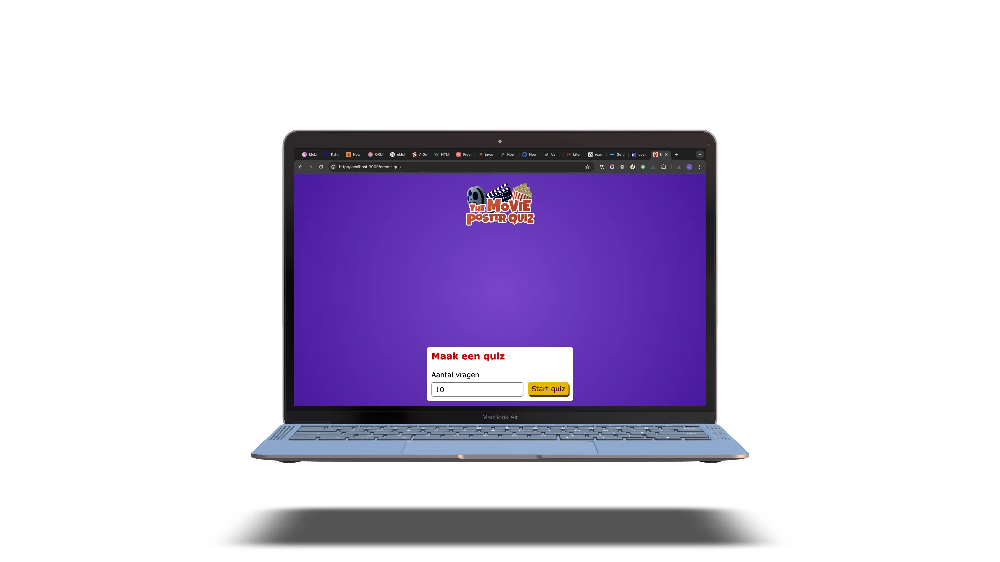

# API @cmda-minor-web 2023 - 2024



## 💡 Mijn idee
Mijn concept is een quiz applicatie zoals Kahoot, maar dan met filmposters. Net als kahoot is er één quiz master en meerdere spelers. Elke vraag bestaat uit een random filmposter, waarbij het de juiste titel moet worden gekozen. Naast de juiste titel staan er nog drie andere random film titels als mogelijke antwoorden.

## 🎥 Filmtitels en -posters
De filmtitels en filmposters haal ik van [*The Movie DB API*](https://developer.themoviedb.org/reference/intro/getting-started).

### 🪫 Lege posters
Voor de quiz is het natuurlijk de bedoeling dat op de poster geen titel staat. Bij *The Movie DB* zijn er per film verschillende posters, waaronder soms ook een zonder titel. Deze is te herkennen aan dat ```poster.iso_639_1 === null```. Dit geeft de taal van de poster aan.

Eerst heb ik geprobeerd een random film via de *API* op te vragen, maar lang niet elke film blijkt een lege poster te hebben. De oplossing die ik hiervoor heb bedacht is om één keer de top 500 films op te vragen. Deze zijn bijna allemaal goed bijgehouden en hebben in ieder geval allemaal een poster waarvan ```poster.iso_639_1 === null```. Helaas zijn er nog een paar waar er dan toch tekst op staat.

```js
const movies = [];

// Get the first 26 pages from the top_rated endpoint from TMDB
for (var i = 1; i < 26; i++) {

    const url = `https://api.themoviedb.org/3/movie/top_rated?page=${i}&adult=false`;
    const options = {
        method: 'GET',
        headers: {
            accept: 'application/json',
            Authorization: 'Bearer ' + process.env.MOVIEDB_API_KEY
    	}
	};

	const response = await fetch(url, options);

	const result = await response.json();

    // Add every result to the movies array
    result.results.forEach(movie => movies.push(movie));
}
```

Vervolgens sla ik deze *array* met films op in een *json*-bestand voor later gebruik.

### 🎲 Random film
Om een random film te krijgen neem ik een random *item* uit de eerder gemaakte *array*. 

```js
// Get a random number based on the amount of movies in the list
const randomMovieId = Math.floor(Math.random() * movies.length);

// Select that movie from the list
const movie = movies[randomMovieId];
```

Vervolgens kan ik hier de poster bij zoeken door opnieuw een *request* te doen naar *The Movie DB* met het ID van de random uitgekozen film.

```js
const getMoviePoster = async (id) => {
  	try {
    	const url = `https://api.themoviedb.org/3/movie/${id}/images?adult=false`;
    	const options = {
      		method: 'GET',
      		headers: {
        		accept: 'application/json',
        		Authorization: 'Bearer ' + process.env.MOVIEDB_API_KEY
      		}
    	};

    	const response = await fetch(url, options);

    	const json = await response.json();

    	// Get the poster with no language (almost always without text)
    	const poster = json.posters.find(poster => poster.iso_639_1 === null);
    }
}

```

Al deze functionaliteiten heb ik in een **aantal verschillende functies** gezet, die de uitkomst *returnen*, voor makkelijk hergebruik:

- ```getMovies()``` geeft de top 500 films.
- ```getMoviePoster(id)``` geeft een poster terug bij een film ID.
- ```getRandomMovie()``` geeft een random film uit het ```movies.json``` bestand.


## ⏳ ***Realtime*** data
Om zowel de quiz master als de spelers tegelijkertijd de vraag te sturen maak ik gebruik van ***server-sent events***.

De voorbeelden op MDN [(Using Server-sent Events - Web APIs | MDN, 2023)](https://developer.mozilla.org/en-US/docs/Web/API/Server-sent_events/Using_server-sent_events) zijn helaas in *PHP*, dus heb ik met een tutorial op Digital Ocean gewerkt [(Alvarez, 2021)](https://www.digitalocean.com/community/tutorials/nodejs-server-sent-events-build-realtime-app).

Ik gebruik *server-sent events* om de verschillende *ui states* naar de gebruikers te sturen.

```js
const playerEventsHandler = (req, res) => {
  const headers = {
    'Content-Type': 'text/event-stream',
    'Connection': 'keep-alive',
    'Cache-Control': 'no-cache'
  };
  res.writeHead(200, headers);

  const clientId = req.cookies.nickname;

  const newClient = {
    id: clientId,
    res
  };

  players.push(newClient);

  req.on('close', () => {
    console.log(`${clientId} Connection closed`);
    players = players.filter(client => client.id !== clientId);
  });
}

const sendEventsToPlayers = (data) => {
  players.forEach(client => client.res.write(`data: ${JSON.stringify(data)}\n\n`))
}
```

Er zijn twee *event handlers*. Eén voor de spelers en één voor de quiz master. Met de functie ```sendEventsToPlayers()``` wordt de ingevulde data naar de spelers verstuurd. In de *front-end JavaScript* wordt vervolgens elk event ingevuld in de ```<main>```.

```js
eventSrc.onmessage = async (event) => {

	if (event.data != 'undefined') {
		const eventData = JSON.parse(event.data);
		main.innerHTML = eventData;
	}
	
}
```

## 🎮 Het spel
Nadat de losse functionaliteiten waaren uitgezocht ben ik begonnen met het maken van het spel zelf. Het spel bestaat uit vijf *endpoints*:

- ```/join``` om als speler een spel te *joinen*,
- ```/player``` voor het spel als speler,
- ```/answer``` om de antwoorden te verwerken en score bij te houden,
- ```/create-quiz``` om als quiz master een quiz aan te maken en
- ```/quiz-master``` voor het spel als quiz master.

### ➕ ***Join***


Het *joinen* van het spel kan met een simpel formulier, waar de speler zijn *nickname* kan invullen. Dit formulier wordt verstuurd naar ```/player```. Als de speler al bestaat, wordt daar opnieuw het formulier gerendered met een error dat de speler al bestaat.

### 🤾 ***Player***


Deze *route* voegt de nieuwe spelers toe aan het *scoreboard array* en geeft, wanneer de quiz start, de eerste vraag. De vraag bestaat weer uit een formulier met vier buttons, voor de mogelijke antwoorden en een aantal *hidden* velden, voor het vraagnummer en het goede antwoord.

### 💬 ***Answer***
Nadat een speler heeft geantwoord, wordt hier het antwoord vergeleken met het goede antwoord. Als die hetzelfde zijn, krijgt de speler er een punt bij in het *scoreboard array*.

```js
if (answer == correctAnswer) {
    const player = scoreboard.find(player => player.nickname == nickname); 
    player.points++;
}
```

Daarna wordt hier of de volgende vraag getoond of het *scoreboard* als de quiz is afgelopen.

### ***Create Quiz***


Via deze *route* kan een quiz worden aangemaakt. Orgineel zouden hier meer opties komen te staan, maar om te kunnen focussen op een goed werkende quiz, heb ik deze voor nu weg gelaten.

Opties zouden kunnen zijn:
- quiz code, om meerder quizen tegelijkertijd te kunnen hebben en
- tijd per vraag.

### 🧑‍🏫 ***Quiz Master***
Dit is eigenlijk de belangrijkste. Vanuit hier word de hele quiz aangestuurd. Zodra deze *endpoint* wordt geopend start de quiz, en worden vanuit hier alle vragen naar gebruikers verstuurd. Dit gaat in een aantal stappen:

1. Dit begint bij een *for loop* die zo vaak loopt als het opgegeven aantal vragen.

	1. In de loop wordt als eerste de *countdown timer* naar de gebruikers verstuurd. Waarna er drie seconden wordt gewacht met een simpele *timer* functie.

	```js
	const timer = (time) => {
 		return new Promise(resolve => setTimeout(resolve, time));
	}
	```

	2. Hierna worden vier random films uitgekozen, waarvan er eentje als juiste wordt gekozen. Deze worden naar beide de *quiz master* en de spelers verstuurd, maar wel in een andere template. Bij de *master* zijn zowel de poster als de opties te zien, hoewel er bij de spelers alleen maar vier knoppen zijn.

2. Na de loop wordt het scoreboard gesorteerd en geladen met de scores van alles spelers.


## ⛲️ Bronnen
- The Movie Database. (z.d.). Getting Started. https://developer.themoviedb.org/reference/intro/getting-started
- Alvarez, S. (2021, 22 maart). How To Use Server-Sent Events in Node.js to Build a Realtime App. DigitalOcean. https://www.digitalocean.com/community/tutorials/nodejs-server-sent-events-build-realtime-app
- Using server-sent events - Web APIs | MDN. (2023, 26 februari). MDN Web Docs. https://developer.mozilla.org/en-US/docs/Web/API/Server-sent_events/Using_server-sent_events